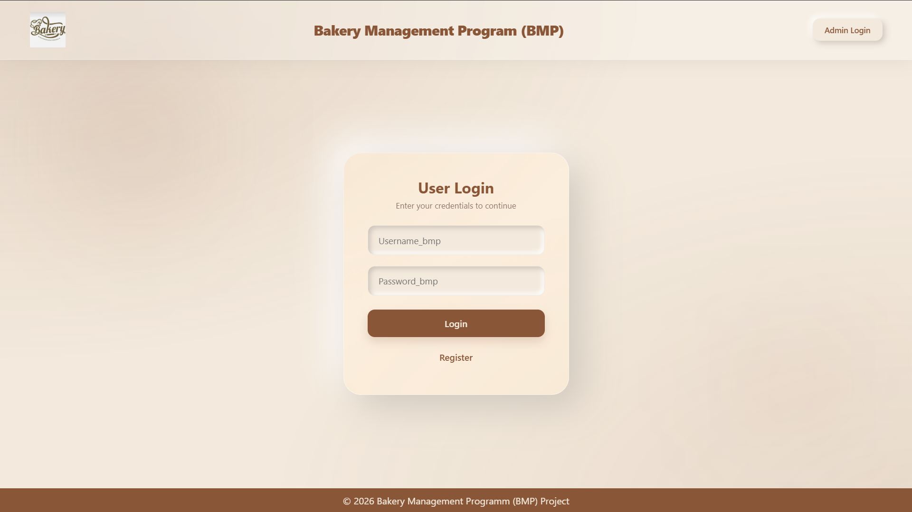
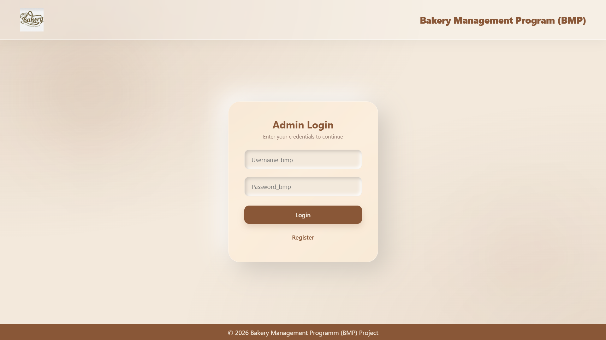
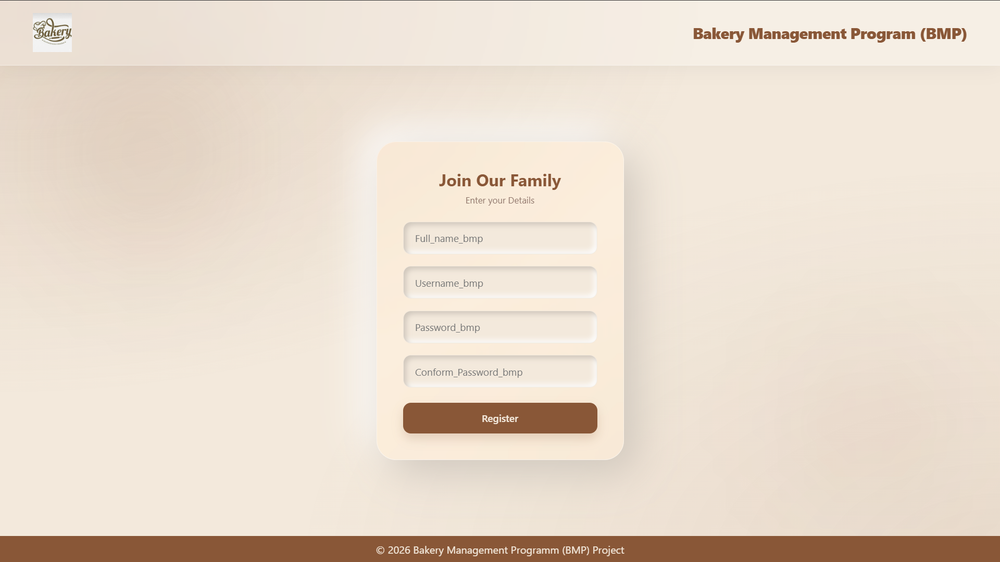
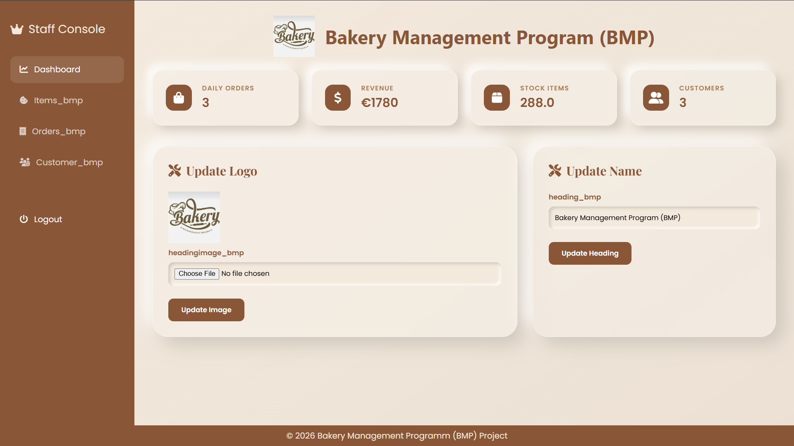
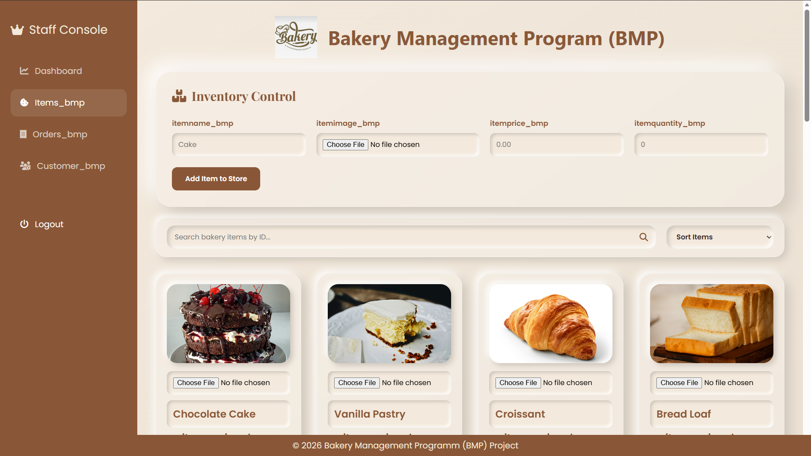
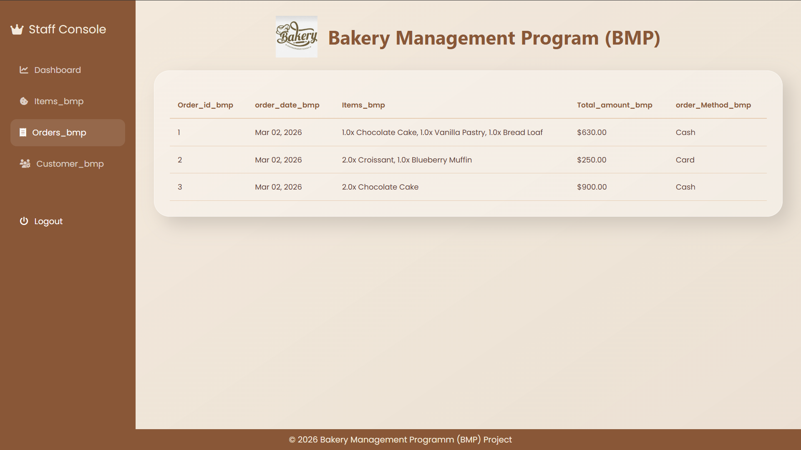
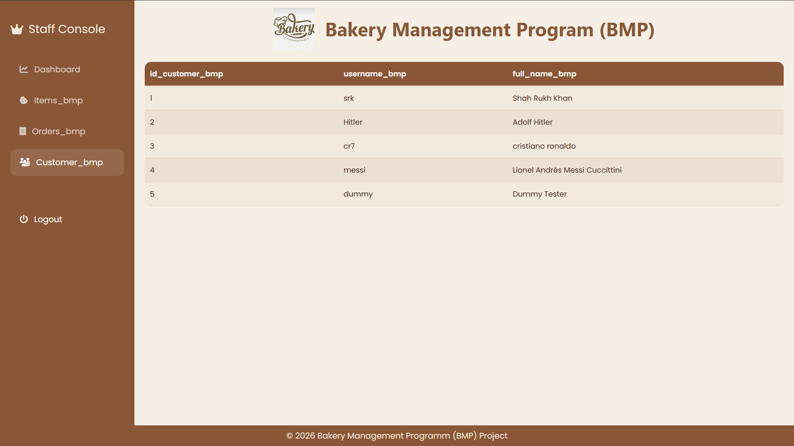
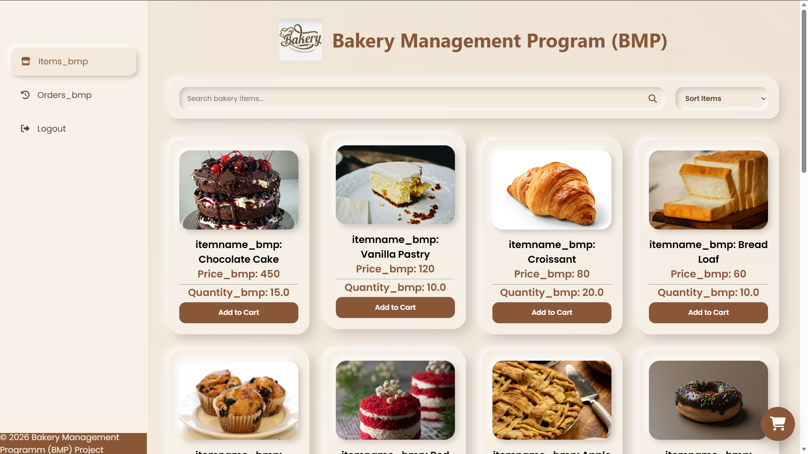
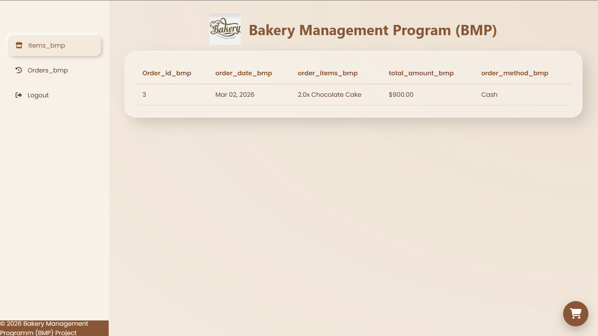

# 🚀 Banking Management Portal (BMP)
## 📌 Project Overview
A web-based Banking Management Portal with separate interfaces for:

Customer

Admin

The system allows secure login, account management, and administrative control features.
## 🛠 Tech Stack

Python

HTML / CSS

Database (MySQL / SQLite / etc.)

## 🔐 Login Portal

## 📝 Registration Portal

## 🧑‍💼 Admin Dashboard

## 👤 Customer Dashboard

## ⚙️ Features

User authentication

Role-based access (Admin / Customer)

Account management

Secure backend logic

## ▶️ How to Run
### Clone repository
git clone https://github.com/ankit02yadav/BMP-SRH.git

### Run project
python bmp.py
